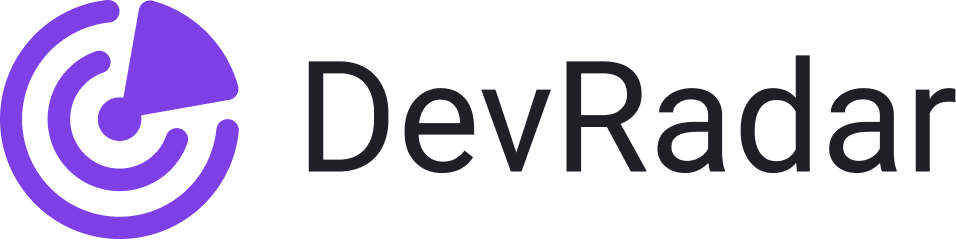
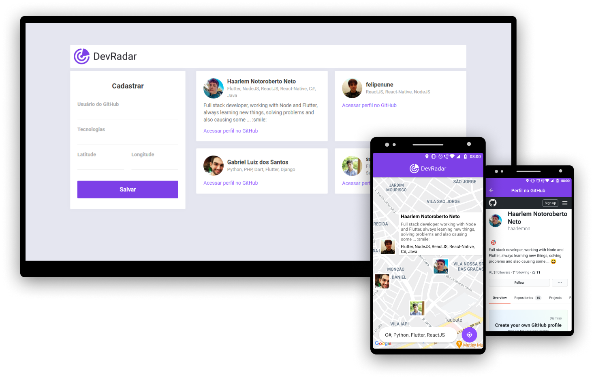

<h1 align="center">
  
</h1>

<h3 align="center">
  DevRadar - Find the developers that are closest to you
</h3>
<br>

>This project was developed for study during the "_Semana Omnistack #10_" workshop conducted by Rocketseat, it contains my own modifications to improve the project.

<p align="center">
  
</p>

<!-- Table of Contents -->
## Table of Contents

* [About the Project](#about-the-project)
  * [Technologies](#technologies)
    * [Backend](#backend)
    * [Web](#web)
    * [Mobile](#mobile)
* [Getting Started](#getting-started)
  * [Requirements](#requirements)
  * [Installation](#installation)
* [License](#license)
* [Contact](#contact)

<!-- About the Project -->
## About the Project

DevRadar is a system to find the developers closest to the user based on the chosen technologies. The system has a web and mobile version:

  - In the web version, a developer is registered, it is possible to use the current system location to say that it is the developer's location, or to enter the location manually. 
  - In the mobile application it is possible to find the developers closest to the user and filter them by technologies. After finding developers it is also possible to see some information and open his GitHub profile in the app. 

After registering a new developer in the system, the application's WebSocket connections are checked and the list of developers is updated in real time for users who are close to the new registered developer.


### Technologies

>The system consists of a backend, web and mobile frontend, below is the list of technologies used for its construction.

#### Backend

- Axios
- Cors
- Dotenv
- Eslint
- Express
- Mongoose
- Node.js
- Prettier
- Socket.io

#### Web

- Axios
- Eslint
- Prettier
- React
- React Router Dom
- Styled-components

#### Mobile

- Axios
- Eslint
- Expo
- Expo Location
- Prettier
- React Navigation
- React-Native
- React-Native Maps
- React-Native WebView
- Socket.io
- Styled-components

<!-- Getting Started -->
## Getting Started

>For the applications to work, some tools installed on your machine are required.

### Requirements

- [Node.js](https://nodejs.org/en/)
- [MongoDB](https://www.mongodb.com/) (To not need to install MongoDB you can use MongoDB Atlas)
- [Expo](https://expo.io/)

### Installation

**First clone the project**

```sh
  git clone https://github.com/haarlemnn/dev-radar
```

**Launch the backend server**

_Attention: Make sure to create your **.env** file based on the **.env.example** sample file_

```sh
  # Access the server folder
  cd server

  # Install the dependencies
  yarn

  # Run the server
  yarn dev
```

**Launch the web application**

_Attention: Make sure that **"web/src/services/api.js"** have the IP and the port on which your backend server is running._

```sh
  # Access the web folder
  cd web

  # Install the dependencies
  yarn

  # Start the client
  yarn start
```

**Launch the mobile application**

_Attention: Make sure that **"mobile/src/services/api.js"** and **"mobile/src/services/socket.js"** have the IP and the port on which your backend server is running._

```sh
  # Access the mobile folder
  cd mobile

  # Install the dependencies
  yarn

  # Start the expo service and scan the QR code with Expo Client
  yarn start
```
<!-- License -->
## License
This project is licensed under the [MIT License](LICENSE)

## Contact
>You can connect and talk to me through my [LinkedIn](https://www.linkedin.com/in/haarlem-notoroberto/).
